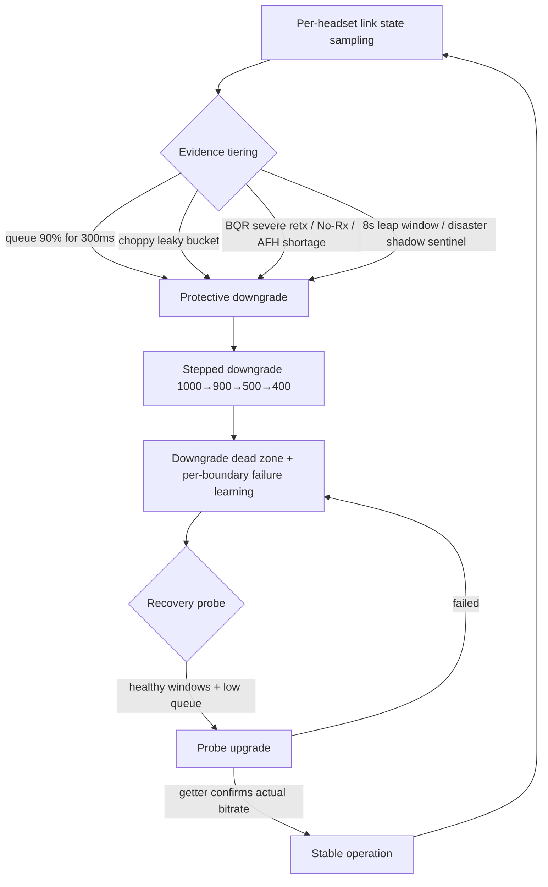

# OPlus Headset Audio Helper

[简体中文](README.md) · [English](README.en-US.md)

<p align="center">
  
</p>

<p align="center">
  <a href="https://github.com/Andrea-lyz/MelodyCodecTweaker/releases/latest">Download Latest</a> ·
  <a href="https://github.com/Andrea-lyz/MelodyCodecTweaker/issues">Report Issues</a> ·
  <a href="https://github.com/Xposed-Modules-Repo/xyz.melodylsp.codec">Xposed Modules Repo</a>
</p>

`MelodyCodecTweaker` is an LSPosed module for the OPPO / OnePlus "Wireless Headphones" app. It adds codec, playback quality, sample rate, and LE Audio controls to the official headset panel. It also provides **automatic single-ear channel merging**: music's left and right channels are mixed when one earbud is worn, and original stereo playback resumes when both earbuds are worn.

The module primarily targets `com.oplus.melody` on ColorOS / OPlus devices, working alongside the `com.android.bluetooth` and `com.oplus.wirelesssettings` scopes for more stable state reading and writing.

## 2.5.0-preview.7: Automatic single-ear channel merging

- Adds a toggle to the main headset and OneSpace panels, off by default and saved per headset, with confirmation when enabling or disabling it.
- Uses left/right wearing reports to merge audio as an adapted player submits it; wearing both earbuds restores stereo playback.
- Currently targets QQ Music and NetEase Cloud Music on Android 16 / arm64. Add the player you use to the LSPosed scope.
- Includes native loading and audio entry-point adaptation. preview.7 fixes argument forwarding during track destruction on song changes and adds fatal crash logs to diagnostic capture.

See [Automatic single-ear channel merging](#automatic-single-ear-channel-merging) below for setup, implementation, and device validation status.

## 2.3.0 Update Highlights

**LHDC V5 fast-switch equivalence patch (native memory patch)**

- Fixes ColorOS 16's `A2DP_CodecEquals` missing the LHDC V5 dispatch: pure quality-tier switches are no longer forced to rebuild the output (previously "environment supports the highest bitrate but switching stutters" — startup congestion after rebuilding the AVDTP link).
- Covers every known version line: PJZ110 16.0.9.401/.402 (device-verified), OP15/Ace6T 16.0.7.201, PJZ110 16.0.8.301/PLK110, PLC110 16.0.8.300, RMX6688 (MTK); the bitrate-branch patch also gains RMX6688 (MTK) support and a semantic-scan fallback.
- The diagnostics page now shows the patch state as two separate rows — **Bitrate Branch Patch** and **Fast-Switch Equivalence Patch** — captured at hook time without needing a recording session.

**Host-side adaptation advisories**

- Switching to "Sound Quality Priority" now reports the patch adaptation state: "Not Adapted, Please Contact Developer" (after a failed write) or "Not Fully Adapted — Severe Stutter May Occur" (shown when selected).
- Memory replay of Sound Quality Priority gets the same advisory (covers patch invalidation after system updates, avoiding silent degradation); the same replay episode only notifies once within a 60-second window.

**Diagnostics page v3**

- Four-tab bottom navigation (Overview / Status / Link / Feedback) with Android gesture-immersion (edge-to-edge) support.
- Overview adds: module activation status, environment scope hook marks (✓/✗/—), a key-status snapshot, and memory cards; the Status tab supports manual refresh (re-queries patch state on demand).

**Bitrate congestion governor (experimental)**

- New experimental switch (off by default, toggled from the diagnostics page, persisted across Bluetooth process restarts).
- Phase N rebuild: unified Target_Cap transactions with a single Java decision brain; layered triggers (choppy leaky bucket, 8-second leap window, disaster shadow sentinels, BQR valid gate, start/switch guards); stepped downgrades, downgrade dead zones and tiered asymmetric recovery; recovery countdown UI with progress-filled boundary bars.
- Refined recovery thresholds: mid-tier 500→900 recovery relaxes the No-Rx gate (non-bad evidence), the strict 900→1000 tier tolerates one-sided hot windows, and hold times escalate with failure history.

**Other fixes**

- With LE Audio / LC3 active, the OneSpace and DetailMain panels no longer open the quality picker.
- Diagnostics details: bottom-nav deformation on scroll, scrollbar, replay-chain display, root-log status copy.

## Support the Author

If this module has been helpful to you, feel free to scan the QR code to buy me a coffee. Thanks for your support, and feel free to contribute to broader device compatibility via Issues or feedback packages.


## Key Features

- Injects a Bluetooth audio quality section into the "Wireless Headphones" main panel `DetailMainActivity`.
- Injects the same control set into the OneSpace quick panel `OneSpaceDetailActivity`.
- Displays the current protocol: SBC, AAC, LDAC, LHDC, LC3, etc.
- Supports playback quality switching, such as LHDC's Adaptive, Connection Priority, and Sound Quality Priority, as well as LDAC's 330 / 660 / 990 kbps.
- Adaptive and Sound Quality Priority modes can display the LHDC encoder's real-time bitrate; Sound Quality Priority can optionally enable the experimental bitrate congestion governor (off by default).
- The LHDC V5 native dual patches (bitrate branch + fast-switch equivalence) cover all known version lines, with "Not Adapted / Not Fully Adapted" host advisories based on the patch adaptation state.
- Supports sample rate switching, dynamically displaying available options like 44.1 / 48 / 96 / 192 kHz based on the current headset and protocol.
- Playback quality and sample rate settings are cross-validated to avoid writing combinations rejected by the Bluetooth stack.
- Supports per-headset memory of selections, automatically applying the last settings upon reconnection.
- Supports an LE Audio toggle: enabling it switches to LC3 and hides playback quality and sample rate options under classic A2DP; disabling it restores classic Bluetooth audio state.
- Supports [automatic single-ear channel merging](#automatic-single-ear-channel-merging) in adapted players, so either earbud can receive content from both original channels, with stereo restored when both are worn.
- Options are hidden or grayed out when the headset is disconnected, the current protocol is uncontrollable, or the headset lacks Hi-Res/LE Audio support, closely mimicking official UI behavior.
- Provides a built-in diagnostics page to view scope loading, page hooks, Bluetooth bridging, wireless settings bridging, native patches, memory replay status, etc., with an option to hide the desktop icon on demand.
- Provides a "Start Recording Issue + Generate Feedback Package" reproduction workflow to help troubleshoot variations across devices, OS versions, headset models, and app versions.

## Requirements

- Android 12 or later for the base features. Single-ear channel merging requires Android 16 / arm64 and a player running in a 64-bit process.
- A framework supporting libxposed API 101, such as the latest LSPosed.
- The "Wireless Headphones" app on OPPO / OnePlus / ColorOS systems: `com.oplus.melody`.
- It is recommended to enable these four base LSPosed scopes:
  - `com.oplus.melody`
  - `com.android.bluetooth`
  - `com.oplus.wirelesssettings`
  - `com.android.settings`

`com.oplus.melody` handles page injection and user interaction, `com.android.bluetooth` ensures more stable reading/writing of A2DP codec states, `com.oplus.wirelesssettings` invokes system-side LE Audio capabilities, and `com.android.settings` is used solely to suppress harmless log noise from LHDC V5 extended values in Developer Options. Omitting scopes may still allow partial functionality, but real-time switching, state feedback, LE Audio, and system settings log suppression are more likely to fail.

For single-ear channel merging, also select the player you use: QQ Music (`com.tencent.qqmusic`) or NetEase Cloud Music (`com.netease.cloudmusic`). If you use only one, adding that player is sufficient.

## Installation & Activation

1. Install the module APK.
2. Enable the module in LSPosed.
3. Check the four base scopes above, plus the relevant player for single-ear channel merging.
4. Restart the relevant processes or reboot. When first enabling or upgrading single-ear support, a reboot is recommended so both the player and Bluetooth service load the new module.
5. Open the "Wireless Headphones" app and navigate to the headset main panel or OneSpace panel to view the injected controls.

To temporarily disable the module, open the desktop icon "OPlus Headset Audio Helper" and turn off the main switch. The host page will fully revert to its original state only after restarting the "Wireless Headphones" app process.

The desktop icon is visible by default. To hide it from the launcher, enable "Hide Desktop Icon" in the diagnostics page; this only controls the launcher alias, does not disable the module, and does not affect LSPosed scope loading or the module entry in the LSPosed manager.

## Automatic single-ear channel merging

Stereo music can place instruments, backing vocals, or effects in different channels. Wearing only the left or right earbud can leave content on the other side unheard. This feature follows the earbuds' actual wearing state and combines both channels for listening with either earbud.

**How to enable it**

1. Follow the installation steps above, enable the module for your player, and reboot.
2. Connect the earbuds and keep their official wearing detection enabled.
3. Open the main "Wireless Headphones" or OneSpace panel, enable the single-ear merge toggle (「单耳自动合并声道」), and confirm.
4. Play music in QQ Music or NetEase Cloud Music, then check the toggle summary and the player channel-merging row in module diagnostics.

The toggle is off by default, saved per headset, and independent of "Remember this headset." Both enabling and disabling require confirmation; canceling leaves the current setting intact.

**When channels are merged**

Both earbuds' states must be known from the current connection, and the headset must be confirmed as the current media output. The other earbud can be outside its case, provided it is explicitly reported as not worn.

| Detected state | Behavior |
| --- | --- |
| Only the left earbud is worn; the right is known not to be worn | Merge both channels for listening with the left earbud |
| Only the right earbud is worn; the left is known not to be worn | Merge both channels for listening with the right earbud |
| Both earbuds are worn | Stop merging and restore original stereo |
| Neither earbud is worn | Stop merging |
| Either side is unknown or reports conflict | Wait for reliable information; a missing report is not treated as "not worn" |
| Disconnection, output change, a call, or expired control messages are detected | Stop merging |

Wearing changes use a short debounce. Turning the feature off also stops merging. An enabled toggle permits automatic processing; **the "channels merged" status requires actual audio frames to have been processed in the current session**.

**How the audio is processed**

The module works on decoded PCM as the player submits it for playback. It averages each stereo sample pair and writes the same result to both output channels:

```text
M = (L + R) / 2
output left  = M
output right = M
```

Either earbud then receives the same combined content. Averaging avoids the output overflow that adding two full-level channels could cause. Stereo positioning is combined while this mode is active, and the loudness of content present on only one side can change.

Processing inside the player also covers adapted DIRECT PCM outputs, which can bypass the system's regular mixer and its mono-audio setting. The mixed PCM continues through the existing output path; the player and system still manage the sample rate, Bluetooth codec, and encoding parameters. Wearing changes enable or disable this PCM processing.

**Compatibility and validation**

- The current implementation targets media tracks in QQ Music and NetEase Cloud Music on Android 16 / arm64, with matching native system audio entry points. The module's general Android 12+ requirement does not extend to this feature.
- It processes streaming stereo PCM. Directly submitted compressed bitstreams, static shared buffers, non-stereo tracks, and unknown formats are skipped. A song being an MP3, AAC, or FLAC file does not itself determine compatibility; the player's actual output path does.
- Routing checks depend on information from the system and audio tracks. Multiple outputs, system routing per app, and different LE Audio configurations still require individual validation.
- Successful single-ear merging has been reported with **Find X9 Ultra / ColorOS 16.0.10.501 + Enco X3 in QQ Music**. NetEase Cloud Music and other device combinations still need device testing. The preview.7 song-switch fix has passed local regression checks; device retesting of consecutive song changes is pending.

If the status reports a missing player or unavailable audio entry point, check the player scope and reboot. To report a problem, start recording, reproduce single-ear playback or song switching, and generate a feedback package. Include the player, phone/OS, earbud model, and which side was worn. See the [PCM implementation notes (Chinese)](docs/player-pcm-preview4.md) and [preview.7 fix and validation notes (Chinese)](docs/player-pcm-preview7.md) for details.

## Built-in Diagnostics Page

The desktop entry opens the built-in diagnostics page. The v3 layout uses a four-tab bottom
navigation (Overview / Status / Link / Feedback) with Android gesture-immersion support:

- **Overview**: module activation status, module master switch, hide-desktop-icon toggle, environment info (with hook ✓/✗ marks for the three host scopes), key-status snapshot, and memory info (current Melody memory + the most recent replay chain).
- **Status**: scopes, page hooks, A2DP and LE Audio bridges, earbud wearing detection, single-ear merging, player audio processing, native patches, and memory replay, with a manual refresh button that re-queries patch state on demand.
- **Link**: the experimental bitrate congestion governor switch, live LHDC BQR environment (KPIs + boundary states + event reasons), and the BQR history window.
- **Feedback**: recording session, feedback package generation, and the recent structured event timeline.

Structured diagnostics do not continuously collect data in the background by default, nor do they repeatedly launch the module process for logging. Clicking "Start Recording Issue" initiates a time-limited recording of up to 30 minutes; it stops immediately after generating a feedback package or automatically upon timeout. A diagnostic status showing "Not Yet Collected" simply means no corresponding events have occurred during the current recording session, not that the module or LSPosed scopes are inactive.

Diagnostic status rows are fully decoupled from feedback recording: normal usage (connecting a headset, opening panels, switching quality, writing memory, etc.) updates the relevant status rows immediately; high-frequency activity events (live BQR samples, remote choppy reports, etc.) still only enter the event ring during a recording session to avoid frequent disk writes.

If you encounter issues like "Page not injected", "Switch failed", "LE Audio status not refreshing", or "Memory not restored after reconnection", it is recommended to click "Start Recording Issue", reproduce the problem once, and then click "Generate Feedback Package". Screenshots of the diagnostics page are also useful for quickly determining whether the issue stems from inactive scopes, lost page hooks, missing Bluetooth bridge signals, missed native patches, or non-functional wireless settings bridges.

## One-Click Feedback Package

The "Generate Feedback Package" option in the diagnostics page will create:

```text
OPlusHeadsetAudioHelper-feedback-YYYYMMDD-HHMMSS.zip
```

Saves to first:

```text
/storage/emulated/0/
```

If the system denies direct root directory access, it falls back to:

```text
/storage/emulated/0/Download/
```

Follow this workflow before submitting feedback; regular users can proceed in order:

1. Confirm the module is enabled in LSPosed with the four base scopes checked. For single-ear merging issues, also check the player scope.
2. Grant root access to "OPlus Headset Audio Helper" in your root manager (KernelSU / Magisk / APatch). The current feedback workflow requires an active recording session with root access to collect Bluetooth logs and system library evidence.
3. Open the "OPlus Headset Audio Helper" diagnostics page and click "Start Recording Issue". If a root permission prompt appears, allow it.
4. Return to the "Wireless Headphones" page and reproduce the issue once (e.g., switching LHDC quality / sample rate, switching AAC / SBC / LHDC, disconnecting/reconnecting the headset, toggling LE Audio, or waiting for "Not Adapted, Please Contact Developer" / "Not Fully Adapted — Severe Stutter May Occur").
5. Return to the diagnostics page and click "Generate Feedback Package".
6. Send the generated `OPlusHeadsetAudioHelper-feedback-YYYYMMDD-HHMMSS.zip` to the developer.

For LHDC V5 native memory patch compatibility, please also provide the device model, OS version, and the current system's `/system/lib64/libbluetooth_jni.so`. This file can be copied via a root file manager or exported via ADB:

```bash
adb pull /system/lib64/libbluetooth_jni.so
```

The feedback package includes device info, module version, related app versions, diagnostic status, recent module event timeline, structured event JSONL, state snapshots, module preferences, `scope.list`, `module.prop`, and module logcat. The module's own logs uniformly anonymize Bluetooth MAC addresses. The current workflow also uses root to capture and filter Bluetooth stack-related logcat entries to verify `quality_mode`, `target bit rate`, `codec_specific_1`, native patch status, and memory replay. It does not actively package user files; vendor Bluetooth stack outputs are outside module control, and root logcat may still contain system information—please verify privacy concerns before submitting.

Common files include:

- `summary.txt`: Overview of device, system, module, and related app versions.
- `diagnostics.txt`: Diagnostics page status summary.
- `timeline.txt`: Module event timeline, suitable for direct reading.
- `events.jsonl`: Structured events, suitable for filtering and analysis.
- `state.json`: Current diagnostic state snapshot.
- `prefs.txt`: Module preferences and diagnostic preferences.
- `logcat-module.txt`: Module-related logcat.
- `logcat-bluetooth-root.txt`: Bluetooth stack, player PCM hooks, audio services, and crash-related logs.
- `audio-state.txt`: AudioPolicy / AudioFlinger snapshots for inspecting the player's output path.
- `native/libaudioclient.so`: The system audio library, when readable, for checking native entry points; its source, size, and hash are listed in `native/manifest.txt`.

## LE Audio Notes

The LE Audio toggle only appears when the module determines the current device supports it. Determination relies on the "Wireless Headphones" app's own state, system Bluetooth UUIDs, Bluetooth-side bridge callbacks, and wireless settings status, preventing false positives when the phone supports LE Audio but the headset does not.

Activation flow:

1. User taps LE Audio in the "Wireless Headphones" main panel or OneSpace panel.
2. Module displays a confirmation dialog within the current Melody Activity.
3. Upon user confirmation, the module sends a request to the system-side scope.
4. The Bluetooth-side bridge sets the LE Audio connection policy and prioritizes calling profile `connect(device)`; it only falls back to OPlus transport broadcast if the profile connection interface is unavailable or final retries fail, preventing unconditional wake-ups of nearby devices / Live prompts.
5. After the Bluetooth stack completes the switch, it callbacks the status; the page shows "LE Audio Connecting" when `enabled=true` but the profile isn't connected, and only shows `Bluetooth Audio Quality: LC3` when `connected=true`.
6. Classic A2DP playback quality and sample rate rows are hidden.

When the case is opened or classic A2DP / ACL reconnects, if the LE Audio policy is still enabled but the LE profile hasn't connected, the Bluetooth side will perform limited retries with generation merging and cooldown to prevent duplicate connection floods from two Melody processes. Disabling LE Audio typically causes the headset to briefly disconnect and reconnect to classic Bluetooth audio; the module delays refreshing A2DP status during this period, so the page may briefly show a waiting state due to Bluetooth stack renegotiation.

## Playback Quality & Sample Rate

The module prioritizes reading real-time capabilities from the system Bluetooth stack rather than hardcoding all headset tiers:

- Current protocol comes from `BluetoothA2dp.getCodecStatus()`.
- Playback quality comes from `codecSpecific1` capability.
- Sample rate comes from `sampleRate` bitmask.
- Writing prioritizes `setCodecConfigPreference()` and waits for system broadcast confirmation.

LHDC displays three fixed strategies to the user, mapped internally as follows:

| Panel Option | Internal Strategy | Behavior |
| --- | --- | --- |
| Adaptive | OPlus / LHDC ABR (Quality Code 9) | Vendor algorithm predicts the link and prioritizes continuous playback; displays encoder current bitrate. |
| Connection Priority | Fixed Mid-Tier (Quality Code 6) | Requests ~500 / 560 kbps, suitable for high-interference or long-distance environments. |
| Sound Quality Priority | 1000 kbps Target (Quality Code 8) | Fixes the highest bitrate per device capability (1000 / 900 kbps). |

Write paths degrade by capability:

1. Direct reflection of hidden A2DP APIs within the Melody process.
2. Write via AIDL bridge registered in `com.android.bluetooth`.
3. If AIDL is blocked by SELinux, write via targeted broadcast bridge with OPlus signature permission and sender identity verification.
4. Attempt writing to Developer Options `Settings.Global` for LDAC / sample rate.
5. Final fallback to root shell.

`Settings.Global` and root fallbacks only temporarily store developer options and do not disable the entire Bluetooth adapter to force renegotiation; the module still reads back the current A2DP state and only reports success if the actual tier matches. If a stored value doesn't take effect immediately, it waits for the next natural reconnection/negotiation and does not mistake a shell exit code for codec activation.

LHDC strategy switching still relies on the vendor Bluetooth stack. The module directly writes the target playback quality / sample rate combination to avoid triggering additional A2DP reconfiguration in a single switch. If the stack rejects the current combination, the module attempts to auto-select a compatible sample rate (e.g., upgrading to an available rate when switching from "Connection Priority / 48 kHz" to "Sound Quality Priority"). Real-time bitrate is read from the encoder state in `liblhdcv5BT_enc.so`; if there's no audio stream, the native helper is unadapted, or the encoder lacks a read interface, the summary only shows the strategy name without fabricating values.

## Compatibility Strategy

The "Wireless Headphones" app is often R8-obfuscated, making direct binding to single class names highly prone to breaking after updates. The current module implements these fallbacks:

- Prioritizes hooking relatively stable Activities in the Manifest, e.g., `DetailMainActivity` and `OneSpaceDetailActivity`.
- Simultaneously hooks PreferenceFragment variants from Melody / COUI / AndroidX.
- Scans FragmentManager at runtime to find pages marked with target PreferenceScreen flags.
- Falls back to finding injection points via Preference keys, page structure, and visible categories.
- Resolves the current headset from Intents, Fragment / Activity fields, and the currently active A2DP device, compatible with navigation paths from system settings into DetailMain.
- Hides or disables controls for devices lacking Hi-Res, LE Audio, or corresponding protocol capabilities.
- Multi-point hooks on system-side Bluetooth and wireless settings reduce the probability of single-point failure after system updates.
- Page snapshots are isolated by normalized MAC; page, request, and real-time snapshot are re-verified against the same headset before writing to prevent leaking previous headset states during rapid page switches.
- PreferenceScreen deduplication uses weak references; Activity destruction (including configuration changes) immediately unregisters page receivers, and async refreshes discard destroyed subscriptions.

These strategies cover many minor updates within the same major version, but the module still relies on vendor-private page structures and hidden APIs, not public SDKs. If the "Wireless Headphones" app or system updates completely change page structures, resource keys, package names, or Bluetooth implementations, partial or complete failure may still occur.

Advice for regular users:

- Avoid frequently updating the "Wireless Headphones" app unless necessary.
- Stick to verified working versions as much as possible.
- Keep old APK backups before updating for easy rollback.
- If the module breaks after an update, please provide the new APK, feedback package, device model, OS version, headset model, and screenshots.

## Known Limitations

- The module can only control A2DP / LE Audio capabilities already negotiated by the current headset and system; it cannot force the headset to support non-existent protocols.
- Phones or headsets that do not support LE Audio will not display the LE Audio toggle.
- Headsets lacking Hi-Res or corresponding page items will use fallback injection points; if the page structure is completely different, they may still fail to display.
- State feedback may be delayed by a few seconds during system freezing of `com.oplus.wirelesssettings`, Bluetooth stack restarts, or headset reconnection periods.
- Some vendor Bluetooth stacks reject specific playback quality / sample rate combinations; the module attempts cross-correction but cannot guarantee real-time activation for all combinations.
- The fast-switch equivalence patch uses exact whole-block signatures: after a system update (OTA recompile) it may report `unsupported` until the corresponding version line is adapted. During that window, switching to "Sound Quality Priority" shows the "Not Adapted / Not Fully Adapted" advisory — this is designed behavior, not a fault.
- After installing or updating the module, restart the Bluetooth process (or reboot the phone) for the new patches and governor to take effect; toggling Bluetooth alone does not count as a process restart.

## Memory Replay Reliability

- Melody's main process and `:fg` process dynamically elect a unique replay owner via file locks to prevent duplicate writes; if the owner is terminated by the system, the surviving process can automatically take over on the next connection event.
- Headset disconnection simultaneously clears pending replays, game mode suppression, and probe states, preventing permanent replay blocking after mid-game disconnects.
- If "Remember this headset" is enabled but A2DP isn't ready, the initial snapshot is backfilled when a valid codec snapshot arrives, avoiding empty records with only a toggle and no replay value.
- When the system explicitly provides an optional codec list, legacy vendor codec IDs not in the list are no longer forced; LHDC variants only allow family alias compatibility when the system fails to enumerate old IDs.
- SBC / AAC replay also compares and restores remembered sample rates; AAC is not forced if it's not in the current optional capabilities.

## Cross-Process Bridge Security

- Targeted broadcasts on Android 14+ use system-provided sender UID / package identity; the Bluetooth side only accepts `com.oplus.melody`, and the Melody side only accepts Bluetooth or wireless settings processes.
- Android 12 / 13 cannot read normal broadcast sender identities, so request and response receivers require OPlus component-safe or Bluetooth privileged signature permissions; compile-time tokens only validate protocol versions and no longer serve as security boundaries.
- The Bluetooth side re-verifies MAC, active connections, codec type, and bitmask capabilities before actually calling `A2dpService`. Diagnostic entries also enforce signature permissions, message length limits, time windows, and frequency limits.

## LHDC V5 Runtime Governance & Memory Patch

The current version provides two kinds of runtime capabilities within the `com.android.bluetooth` process: **two ARM64 memory patches** (fixing two independent ColorOS 16 Bluetooth stack issues) and the **encoder governor** (experimental bitrate congestion governor).

### Dual patches: bitrate branch & fast-switch equivalence

- **Bitrate branch patch**: fixes ColorOS 16 Bluetooth stacks ignoring LHDC V5 fixed 900 / 1000 kbps target bitrates — "Sound Quality Priority" writes are not followed, leaving playback at the vendor ABR value.
- **Fast-switch equivalence patch**: fixes `A2DP_CodecEquals` missing the LHDC V5 dispatch after the refactor — pure quality-tier switches are judged as requiring output rebuild (`restart_output=true`), rebuilding the AVDTP link and causing startup congestion stutter; the patch reproduces the legacy LHDC V5 vendor equality mask so pure quality-bit changes take the "equal" path (`restart_output=false`).

Adaptation matrix (both patches cover all known version lines):

| Version line | Device / SoC | Bitrate branch | Fast-switch equivalence |
| --- | --- | --- | --- |
| 16.0.9.401 / .402 | PJZ110 (OnePlus 13 / OnePlus 11) | ✅ | ✅ device-verified |
| 16.0.7.201 | OP15 / Ace6T (Snapdragon 8 Gen 5) | ✅ | ✅ |
| 16.0.8.301 | PJZ110 / PLK110 | ✅ | ✅ |
| 16.0.8.300 | PLC110 (Dimensity 9400+) | ✅ | ✅ |
| RMX line | RMX6688 (Dimensity 9400+) | ✅ | ✅ |

The diagnostics page shows the patch state as two separate rows — "Bitrate Branch Patch" and "Fast-Switch Equivalence Patch". When switching to "Sound Quality Priority", the host reports the adaptation state: "Not Adapted, Please Contact Developer" when the patch is missing, or "Not Fully Adapted — Severe Stutter May Occur" when only the fast-switch patch is missing; memory replay is reminded the same way (see the governor section below).

### Encoder governor (bitrate congestion governor)

The governor parses exported symbols from the currently loaded `liblhdcv5BT_enc.so`, and searches for the unique callback owners of `lhdcv5BT_encode` and `lhdcv5BT_free_handle` in the writable data segment or adjacent anonymous `.bss` of `libbluetooth_jni.so`. Only when both owners are uniquely matched does it wrap the encode/free calls via atomic pointer replacement, capture the active handle from the real encode path, and call `lhdcv5BT_set_target_bitrate_inx` to adjust the bitrate, reading back via `lhdcv5BT_get_bitrate`. It does not modify loader entries, relocations, GOT, or executable pages; installation stops immediately if candidates are zero or multiple.

The Java side consolidates queue, remote choppy, and BQR data into per-headset link states; the native side only executes 1000 / 900 / 500 / 400 kbps gradient switching in Sound Quality Priority mode. Strategy switches, encoder handle changes, or headset releases reset corresponding runtime states to prevent invalid handles from carrying over to the next audio stream.

Compatibility criteria:

- The governor does not hardcode addresses by device model. It requires `liblhdcv5BT_enc.so` to retain four target exports, and requires encode/free callbacks to each have exactly one owner in the current `libbluetooth_jni.so` writable data region.
- The patch prioritizes hitting known machine code patterns near target functions within `/system/lib64/libbluetooth_jni.so`, rather than hardcoding device whitelists.
- When known patterns miss, a semantic scanner identifies the same protection branch via ARM64 instruction semantics and control flow relationships, dynamically generating patch instructions based on the original branch target. Compiler changes to register allocation, source line constants, or branch distances typically no longer require per-OTA pattern additions.
- Newly verified OnePlus 13 PJZ110 `16.0.9.401` Bluetooth libraries successfully hit patterns; previously tested OnePlus 13, OnePlus 15, OnePlus Ace 6 Pro, OnePlus Ace 6T, OnePlus 12, and user-reported PLC110 `C16.0.8.300` can lift system-side restrictions on LHDC V5 fixed 1 Mbps target bitrate.
- Whether the governor can run and whether the current environment can stably maintain 1000 kbps still depends on system Bluetooth library layout, headset, headset firmware, sample rate, and wireless link. The governor safely aborts if uninstalled, never forcibly writing to unknown owners or addresses.

Patch workflow:

- Loads the APK-bundled `libmelody_lhdc_patch.so` within the `com.android.bluetooth` process.
- Scans the currently mapped `/system/lib64/libbluetooth_jni.so`.
- First matches target functions by machine code byte signatures of known Bluetooth library families; currently covers tested variants like `branch_plus_69`, `branch_plus_23_op15`, `branch_plus_73_plc110`, `branch_plus_68_pjz110_1609401`, etc.
- When known byte signatures miss, the semantic scanner verifies shared jump targets, `cmp #0x13`, `sub #7`, `cmp #2`, `b.hs`, and fixed quality mode 4 control flow constraints; writes only on unique full-library hits.
- Only when a known signature or semantic control flow uniquely hits does it call the native helper to write the corresponding 4-byte ARM64 instruction.
- The native helper re-verifies expected instructions, completes replacement with aligned 32-bit atomic writes, then executes instruction cache flush, read-back verification, and restores original memory page permissions.
- Safely skips if the kernel denies writable mappings with executable attributes, no longer temporarily removing `PROT_EXEC`; rolls back original instructions and flushes cache again if permission restoration fails.
- Does not replace system files, copy system libraries, or create KernelSU / Magisk mounts.

The "pattern" here refers to the machine code byte signature near the target function in `libbluetooth_jni.so`, not an APK signature, system certificate, or device model. Compatibility determination prioritizes unique hits of known patterns or semantic control flow; device and OS versions serve only as reference for feedback, reproduction, and archiving. Manual re-analysis is only needed if the target function's actual logic or critical control flow changes, or if scan results are no longer unique.

Patch status can be verified via logcat. Patch logs are output only once upon Bluetooth process startup or retry; if missed at startup, subsequent checks may show no output.

In PowerShell, start real-time monitoring first:

```powershell
adb logcat -c
adb logcat -v time MelodyCodecLsp:V LSPosedFramework:I '*:S' | Select-String "lhdc.memory_patch"
```

Then in another terminal, restart the Bluetooth process or reboot the device:

```powershell
adb shell su -c "killall com.android.bluetooth"
```

Monitoring commands for Git Bash / macOS / Linux:

```bash
adb logcat -c
adb logcat -v time MelodyCodecLsp:V LSPosedFramework:I '*:S' | grep 'lhdc.memory_patch'
```

On success, you typically see:

```text
evt=lhdc.memory_patch.native_loaded path=.../libmelody_lhdc_patch.so
evt=lhdc.memory_patch status=patched detail=pattern=branch_plus_69 ... success=true
```

If the Bluetooth process is already patched, it may show:

```text
evt=lhdc.memory_patch status=already_patched ... success=true
```

If the current ROM's `libbluetooth_jni.so` is not covered, the module safely skips it, e.g.:

```text
evt=lhdc.memory_patch status=unsupported ... patched=0 original=0 success=false
```

This does not replace system files nor forcibly write to unknown addresses. Please provide a feedback package or the corresponding `libbluetooth_jni.so` for future pattern additions. The `diagnostics.txt`, `timeline.txt`, and `events.jsonl` in the feedback package will record the native patch status.

On headset links supporting 1 Mbps, successful strategy writes show `quality_mode=HIGH1_1000(8)`; after playback starts, the summary displays the real-time bitrate read back by the governor. If the environment doesn't support 1000 kbps, the governor may stably settle at 900, 500, or 400 kbps, which still belongs to the "Sound Quality Priority" strategy, not a fallback to "Adaptive". If the current headset/system combination only exposes up to 900 kbps to the stack, the module treats 900 kbps as a valid confirmation for Sound Quality Priority.

To verify 1000 kbps, enable real-time monitoring first, then trigger an A2DP renegotiation (e.g., switch to Adaptive and back to Sound Quality Priority in the module, or reconnect the headset). Do not just query with `logcat -d` during stable playback; the encoder does not continuously output the current bitrate.

```powershell
adb logcat -c
adb logcat -v time -b all | Select-String "quality_mode=HIGH1_1000|target bit rate: 8|max bit rate: 8|codec_specific_1: 32776|ignore target bitrate|write.timeout"
```

Git Bash / macOS / Linux:

```bash
adb logcat -c
adb logcat -v time -b all | grep -E 'quality_mode=HIGH1_1000|target bit rate: 8|max bit rate: 8|codec_specific_1: 32776|ignore target bitrate|write.timeout'
```

## Bitrate Congestion Governor (Experimental)

The governor solves a core problem: **"Sound Quality Priority" is not about welding 1000 kbps permanently, but about expressing the user's quality ceiling and recovery preference**. It actively approaches 1000 kbps when the link can handle it, prioritizes playback continuity during congestion, and steps back up tier by tier after the environment recovers — neither staying low for long after a single glitch, nor blindly pushing high tiers during obvious congestion.

It normalizes three kinds of evidence into per-headset link states and protects/recovers across the 1000 / 900 / 500 / 400 kbps gradient:

- **Encoding queue**: `getAudioQueueLengthNative()` sampled by the Bluetooth main thread; protection downgrade at 90% capacity for 300ms, immediate handling when full.
- **Headset choppy reports**: `onRemoteChoppyReport()` continuous reports within 5 seconds deepen the protection and feed a leaky bucket, preventing a single glitch from overreacting.
- **System BQR**: AFH available channels, retransmissions, No-Rx, overflow / underflow, etc.; valid sampling windows 3–15s, upgrades require consecutive healthy windows.

Decision flow (simplified):



Key design:

- **Layered triggers**: mild pressure takes shadow protection / gentle downgrades; severe signals (full queue, consecutive choppy, BQR deterioration) trigger immediate protection; the 8-second leap window and disaster shadow sentinels prevent short bursts from being missed.
- **Stepped downgrades & asymmetric recovery**: one tier at a time to avoid overreaction; recovery thresholds differ per tier (500→900 relaxes the No-Rx gate, the strict 900→1000 tier tolerates one-sided hot windows), with hold times escalating by failure history (120 / 240 / 300s).
- **Per-headset learning**: 500→900 and 900→1000 boundaries keep separate failure records; switching headsets does not inherit another device's bad-link judgments.
- **Fail-safe closure**: if native owners are ambiguous, encoder interfaces are unavailable, or writes cannot be confirmed, the governor only downgrades or holds — it never forces writes to unknown addresses.

This feature is **experimental**: the "Link" tab of the diagnostics page provides the switch (off by default, persisted across Bluetooth process restarts). When enabled, brief bitrate drops may occur in mobile / interference-heavy environments — that is the protection mechanism itself, not a fault.

Full algorithm, state machine and decision details: [governor-algorithm.en.md](docs/governor-algorithm.en.md)（[简体中文](docs/governor-algorithm.md)）。

### Deprecated KernelSU / Magisk Native Patch

`ksu/oplus_lhdcv5_native_patch/` retains legacy KernelSU / Magisk compatibility module source code, kept only for historical reference and extreme fallback. It replaces the current device's `libbluetooth_jni.so` copy via a system-level overlay; although it dynamically matches byte signatures during installation, it still creates a detectable systemless mount.

Regular releases no longer recommend packaging or uploading this KSU / Magisk zip. Manual use of this legacy source is only considered if the built-in runtime memory patch fails to load or hit signatures, and the user explicitly accepts the KernelSU / Magisk mount risks.

The legacy patch module does not bundle any device's `libbluetooth_jni.so`. Upon flashing, it reads the current system's `/system/lib64/libbluetooth_jni.so`, copies it to the module overlay path, and modifies 4 bytes on-site only if known original byte signatures uniquely match; mismatches or multiple hits abort installation to prevent patching other ROM layouts incorrectly. Installation info is written to `/data/adb/modules/oplus_lhdcv5_native_patch/patch-info.txt` and also output via the `OPlusLHDCV5Patch` logcat tag after boot.

If manual packaging of the legacy patch is truly needed, generate the zip from the source directory:

```bash
cd ksu/oplus_lhdcv5_native_patch
zip -r ../../OPlus-LHDCV5-Native-Patch-0.3-dynamic-test.zip .
```

Ensure the zip internal paths use `/` as separators, e.g., `META-INF/com/google/android/updater-script`. Do not use packaging methods that generate backslash entries like `META-INF\com\...`; such packages may still mount successfully but will show abnormal paths in KernelSU / Magisk managers.

## Log Troubleshooting

During debugging, you can capture:

```bash
adb logcat -s MelodyCodecLsp:V
```

Common keywords:

- `evt=scope.host.start` / `evt=scope.host.context.ready`: Whether the Wireless Headphones scope loaded.
- `evt=preference.fragment.hooked`: Whether PreferenceFragment Hook installed.
- `evt=detailmain.activity.hooked`: Whether main panel Activity Hook installed.
- `evt=onespace.activity.hooked`: Whether OneSpace Activity Hook installed.
- `evt=mac.resolved`: Whether current headset address resolved successfully.
- `detailmain_fallback.injected` / `hires_anchored.injected` / `onespace.injected`: Whether page injection succeeded.
- `evt=scope.system.context.ready`: Whether Bluetooth scope loaded.
- `evt=codec.updated.hooks`: Whether Bluetooth-side codec update Hook installed.
- `evt=scope.wirelesssettings.context.ready`: Whether wireless settings scope loaded.
- `le.melody.state.recv`: Whether LE Audio state callback to Melody succeeded.
- `evt=lhdc.memory_patch`: LHDC V5 runtime memory patch load, hit, and verification status.
- `evt=lhdc.memory_patch.fast_switch`: LHDC V5 fast-switch equivalence patch load, hit, and verification status.
- `evt=native.patch.state.recv`: Host-received patch state broadcast (including the `fast_switch=` field).
- `evt=native.patch.advisory` / `evt=replay.advisory`: Adaptation advisories when switching to "Sound Quality Priority" or replaying memory.
- `evt=lhdc.governor.install` / `LhdcGovernorNative`: Encoder callback owner scan, strategy switch, and bitrate upgrade/downgrade.
- `evt=lhdc.link.bqr_summary`: BQR link samples, health windows, current probe caps, and lock status for both upgrade boundaries.
- `evt=lhdc.governor.choppy_hooks` / `evt=lhdc.governor.queue_hooks`: Whether the headset choppy and encoding queue hooks installed.
- `evt=remember.write`: Whether per-headset memory written.
- `evt=replay.dispatch` / `evt=replay.outcome`: Post-reconnection memory replay and confirmation results.
- `evt=diag.session.start`: Diagnostics page started an issue recording session.
- `write.path`: Which actual write path playback quality / sample rate used.
- `切换未生效` (Switch not effective): Bluetooth stack rejected the write or readback unconfirmed.

## Building

The project uses Android Gradle Plugin, targeting Java 17. R8 is currently disabled for release builds to preserve clear hook troubleshooting paths.

Local build:

```bash
gradle wrapper --gradle-version 8.13
./gradlew :app:assembleRelease
```

Output location:

```text
app/build/outputs/apk/release/
```

GitHub Actions are split into two entry points:

- `Build APK`: Executes on pushes to `main` / `master`, PRs, or manual triggers; used for daily development builds, artifact name is `OPlusHeadsetAudioHelper-<short-sha>-<date>.apk`.
- `Release APK`: Manual trigger only. It automatically bumps `versionName` and `versionCode` by patch / minor / major or specified version, builds a signed APK, commits version changes, creates an Xposed Modules Repo-compliant `versionCode-versionName` tag (e.g., `4-1.2.0`), and writes manual notes + auto-generated commit records in the GitHub Release. The release workflow only syncs the user-facing README, scope metadata, and necessary images to `Xposed-Modules-Repo/xyz.melodylsp.codec`; source code always remains the source of truth for this repository; the workflow requires configuring the `LSP_REPO_TOKEN` secret.
- The KSU / Magisk native patch is deprecated and no longer distributed as a standard Release attachment; if an extreme fallback is needed, the zip can be manually generated from `ksu/oplus_lhdcv5_native_patch/`.

## Project Structure

```text
app/src/main/
├── AndroidManifest.xml
├── resources/META-INF/xposed/
│   ├── java_init.list
│   ├── module.prop
│   └── scope.list
├── aidl/xyz/melodylsp/codec/bridge/
└── java/xyz/melodylsp/codec/
    ├── MelodyCodecLspEntry.java
    ├── bt/          # A2DP hidden API reflection
    ├── bridge/      # AIDL Parcelable types
    ├── diag/        # Structured diagnostic events, reproduction recording & feedback packages
    ├── host/        # Melody page injection & UI control
    ├── leaudio/     # LE Audio state, IPC & wireless settings bridging
    ├── storage/     # Per-headset memory storage
    ├── system/      # com.android.bluetooth side bridge, BQR & link state machine
    ├── ui/          # Built-in diagnostics page, main switch & desktop icon toggle
    └── util/        # Logging

app/src/main/cpp/
└── native_lhdc_patch.cpp  # ARM64 safe patch, encoder capture & bitrate governor

docs/lsp/
├── README.md        # Xposed Modules Repo user-facing release page
├── SCOPE
├── SOURCE_URL
└── SUMMARY

ksu/oplus_lhdcv5_native_patch/
├── META-INF/com/google/android/updater-script
├── customize.sh    # Legacy fallback: dynamically patches current system libbluetooth_jni.so at install
├── module.prop
└── service.sh      # Outputs patch-info to logcat after boot
```

## License

This project is licensed under the Apache-2.0 License.
