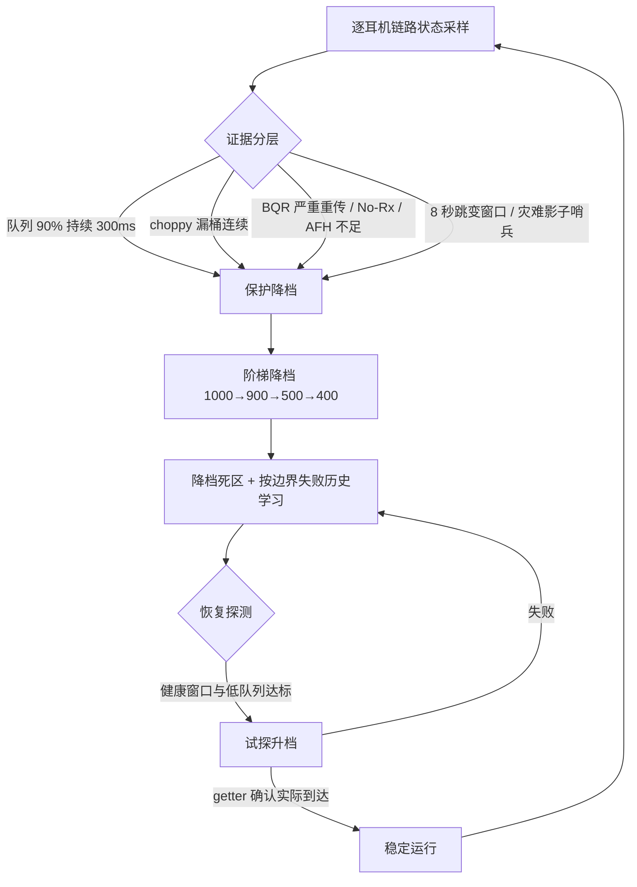

# 欧加耳机音质助手-个人修改版

[简体中文](README.md) · [English](README.en-US.md)

<p align="center">
  
</p>

<p align="center">
  <a href="https://github.com/Andrea-lyz/MelodyCodecTweaker/releases/latest">下载最新版</a> ·
  <a href="https://github.com/Andrea-lyz/MelodyCodecTweaker/issues">问题反馈</a> ·
  <a href="https://github.com/Xposed-Modules-Repo/xyz.melodylsp.codec">Xposed Modules Repo</a>
</p>

`MelodyCodecTweaker` 是一个面向 OPPO / OnePlus「无线耳机」App 的 LSPosed 模块，在官方耳机面板中加入编解码器、播放质量、采样率和 LE Audio 控制。模块还提供**单耳自动合并声道**：只佩戴一只耳机时，将音乐的左右声道混合；重新戴上双耳时，恢复原始立体声。

模块主要服务于 ColorOS / OPlus 系设备上的 `com.oplus.melody`，同时配合 `com.android.bluetooth` 和 `com.oplus.wirelesssettings` 作用域完成更稳定的状态读取和写入。

## 2.5.0-preview.7：单耳自动合并声道

- 在官方主面板和 OneSpace 面板新增单耳合并开关，默认关闭、按耳机保存，开启和关闭均需确认。
- 读取左右耳佩戴状态，在已适配播放器提交音频时合并左右声道；双耳佩戴时恢复立体声。
- 当前适配 QQ 音乐、网易云音乐，功能要求 Android 16 / arm64，并额外启用所用播放器的 LSPosed 作用域。
- 完成原生库加载与音频入口适配；preview.7 修复了切歌释放音轨时的参数转发错误，并补充崩溃日志采集。

功能原理、开启方法和实测范围见下方 [单耳自动合并声道](#单耳自动合并声道)。

## 2.4.1 更新重点

**非金标版本线（< 16.0.7）补丁误报修复（PJD110 16.0.3.500 反馈定位）**

- 修复系统版本低于 16.0.7 时补丁状态误报：这类系统 LHDC V5 为原生支持、本就不需要内存补丁，此前切换「音质优先」可能误弹「未适配，请联系开发者反馈」，诊断页「码率 branch 补丁」「快切等价补丁」两行误显示红叉。
- 新增版本线门控：按 `Build.DISPLAY` 的「型号_版本线(地区)」形状识别 ColorOS 版本线，低于 16.0.7.0 时短路补丁流程、上报 `not_required`（原生支持）——诊断页两行显示绿勾，切换音质优先不再弹任何补丁提示；16.0.7 及以上版本线仍按适配矩阵工作，行为不变。
- 版本线形状不符时保持保守，仍走 pattern 扫描，不做猜测性短路。
- 诊断页与反馈包支持 `not_required` 状态，区分「无需补丁」与「尚未适配」。

**文档**

- README 与发布页同步 2.4.1 行为说明与更新日志。

## 支持作者

如果这个模块对你有帮助，可以扫码请原作者喝杯咖啡。感谢支持，本仓库版本仅限支持单耳机合并声道功能,感谢原作者制作了本软件的基础功能。


## 主要功能

- 在「无线耳机」主面板 `DetailMainActivity` 注入蓝牙音质区域。
- 在 OneSpace 快捷面板 `OneSpaceDetailActivity` 注入同一套控制项。
- 显示当前协议：SBC、AAC、LDAC、LHDC、LC3 等。
- 支持播放质量切换，例如 LHDC 的自适应、连接优先、音质优先，以及 LDAC 的 330 / 660 / 990 kbps。
- 自适应与音质优先可显示 LHDC 编码器实时码率；音质优先可选开启实验性码率拥塞治理器（默认关闭）。
- LHDC V5 native 双补丁（码率 branch / 快切等价）覆盖全部已知版本线，并按适配状态在宿主给出「未适配 / 未完整适配」提醒。
- 支持采样率切换，根据当前耳机和协议动态显示 44.1 / 48 / 96 / 192 kHz 等可选项。
- 播放质量和采样率会做联动修正，尽量避免写入蓝牙栈不接受的组合。
- 支持按耳机记忆选择，重新连接后自动应用上次设置。
- 支持 LE Audio 开关：开启后进入 LC3，并隐藏经典 A2DP 下的播放质量和采样率选项；关闭后恢复经典蓝牙音频状态。
- 支持[单耳自动合并声道](#单耳自动合并声道)：在受支持的播放器中，让仅佩戴的一只耳机也能听到原本分布在左右声道的内容，双耳佩戴时恢复立体声。
- 耳机未连接、当前协议不可控、耳机不支持 Hi-Res 或 LE Audio 时，会隐藏或置灰对应选项，尽量贴近官方控件表现。
- 提供模块内置诊断页，可以查看作用域加载、页面 Hook、蓝牙桥接、无线设置桥接、native 补丁、记忆重放等状态，并可按需隐藏桌面图标。
- 提供「开始记录问题 + 生成反馈包」的复现记录流程，便于排查不同手机、系统版本、耳机型号和「无线耳机」版本带来的差异。

## 使用要求

- 基础功能要求 Android 12 及以上；单耳自动合并声道要求 Android 16 / arm64，且播放器运行于 64 位进程。
- 支持 libxposed API 101 的框架，例如新版 LSPosed。
- OPPO / OnePlus / ColorOS 系统上的「无线耳机」App：`com.oplus.melody`。
- 建议启用以下四个基础 LSPosed 作用域：
  - `com.oplus.melody`
  - `com.android.bluetooth`
  - `com.oplus.wirelesssettings`
  - `com.android.settings`

`com.oplus.melody` 负责页面注入和用户交互，`com.android.bluetooth` 负责更稳定地读写 A2DP 编解码器状态，`com.oplus.wirelesssettings` 负责调用系统侧 LE Audio 能力，`com.android.settings` 只用于收敛开发者选项里 LHDC V5 扩展值造成的无害日志噪音。少开作用域可能仍能部分工作，但实时切换、状态回读、LE Audio 和系统设置侧日志降噪会更容易失效。

使用单耳自动合并时，还需勾选实际使用的播放器：QQ 音乐 `com.tencent.qqmusic`、网易云音乐 `com.netease.cloudmusic`。只使用其中一个时，额外勾选该播放器即可。

## 安装与启用

1. 安装模块 APK。
2. 在 LSPosed 中启用模块。
3. 勾选上面四个基础作用域；使用单耳自动合并时，再勾选相应播放器。
4. 重启相关进程或手机；首次启用或升级单耳合并功能时，建议直接重启手机，确保播放器和蓝牙服务都加载新版。
5. 打开「无线耳机」App，进入耳机主面板或 OneSpace 面板查看注入项。

如果只想临时停用模块，可以打开桌面图标「欧加耳机音质助手」，关闭模块总开关。关闭后需要重启「无线耳机」进程，宿主页才会完全恢复原状。

桌面图标默认显示。若不希望启动器里出现模块图标，可以在诊断页打开「隐藏桌面图标」开关；这个开关只控制 launcher alias，不会禁用模块，也不会影响 LSPosed 作用域加载或 LSPosed 管理器里的模块 UI 入口。

## 单耳自动合并声道

有些立体声音乐会把乐器、和声或音效分别放在左右声道。只戴左耳或右耳时，可能听不到另一侧的内容。开启本功能后，模块根据耳机的实际佩戴状态自动混合两路声音，让单耳也能听到原本分布在两侧的内容。

**开启方法**

1. 按上面的安装步骤启用模块及所用播放器的作用域，并重启手机。
2. 连接耳机，保持官方耳机佩戴检测开启。
3. 在「无线耳机」主面板或 OneSpace 面板找到「单耳自动合并声道」，开启并确认。
4. 在 QQ 音乐或网易云音乐中播放音乐，查看开关摘要和模块诊断中的「播放器声道合并」状态。

开关默认关闭，按耳机分别保存，独立于「记住此耳机」。开启、关闭都会弹出确认框；取消或返回不会改变当前设置。

**何时合并，何时恢复**

模块要求在本次连接中已获知左右耳状态，并确认这副耳机是当前媒体输出。另一只耳机不必放进充电盒，只要明确未佩戴即可。

| 检测到的情况 | 处理方式 |
| --- | --- |
| 仅左耳佩戴，右耳明确未佩戴 | 合并左右声道，左耳可以听到两路内容 |
| 仅右耳佩戴，左耳明确未佩戴 | 合并左右声道，右耳可以听到两路内容 |
| 双耳佩戴 | 停止合并，恢复原始立体声 |
| 两耳均未佩戴 | 停止合并 |
| 某侧状态未知或状态冲突 | 等待可靠状态，不把缺失上报当作未佩戴 |
| 检测到断连、输出改变、通话，或控制消息超时 | 停止合并 |

佩戴变化经过短暂防抖。关闭功能也会停止合并；开关处于开启状态仅表示允许自动处理，**「左右声道已合并」需要本次播放确实处理到音频帧后才会显示**。

**声音如何合并**

处理发生在播放器提交已解码的 PCM 音频时。对每个双声道采样帧，模块取左右平均值，并把结果写入两个输出声道：

```text
M = (L + R) / 2
输出左声道 = M
输出右声道 = M
```

这样，无论佩戴哪一侧，都能收到相同的混合内容。取平均值可以避免两路直接相加造成峰值超限；单耳模式会合并立体声定位，某些只出现在一侧的声音响度也会变化。

播放器内完成的混合还可以覆盖已适配的 DIRECT PCM 直通输出；这类输出可能绕过系统的常规混音器，导致系统「单声道音频」开关无法覆盖。混合后的 PCM 继续沿原音频通路输出，采样率、蓝牙协议和编码参数仍由播放器与系统管理，正常摘戴切换通过启停 PCM 合并完成。

**支持范围与验证情况**


- 当前只适配 QQ 音乐和网易云音乐的媒体音轨，要求 Android 16 / arm64，并能匹配系统的原生音频接口。模块其他功能的 Android 12+ 要求不代表单耳合并也支持这些旧系统。
- 处理对象是流式双声道 PCM。播放器直接提交压缩码流、使用静态共享缓冲、非双声道或未知格式时会跳过合并；歌曲文件是 MP3、AAC 或 FLAC 本身不决定是否支持，取决于实际输出路径。
- 路由判断依赖系统和音轨提供的信息。多设备输出、系统按 App 分流以及不同 LE Audio 组合仍需分别验证。
- 已有 **Find X9 Ultra / ColorOS 16.0.10.501 + Enco X3、QQ 音乐**的单耳合并成功反馈。网易云音乐和其他设备组合仍待补充实测；preview.7 的切歌修复已通过本地回归，连续切歌的真机复测仍待补充。

若状态显示等待播放器或入口不可用，先核对播放器作用域并重启手机。反馈时请开始记录，复现单耳播放或切歌问题，再生成反馈包；同时说明播放器、手机系统、耳机型号，以及当时佩戴哪一侧。实现与路由说明见 [PCM 合并说明](docs/player-pcm-preview4.md)，切歌修复及验证证据见 [preview.7 说明](docs/player-pcm-preview7.md)。

## 内置诊断页

模块桌面入口是内置诊断页，v3 版本采用四分类底部导航（概览 / 状态 / 链路 / 反馈），并适配 Android 手势沉浸：

- **概览**：模块激活状态、模块总开关、隐藏桌面图标、环境信息（含三个宿主作用域的 hook 勾叉标记）、关键状态速览、记忆信息（当前 Melody 真实记忆 + 最近一次恢复链路）。
- **状态**：作用域、页面 Hook、A2DP 与 LE Audio 桥、左右耳佩戴检测、单耳合并、播放器音频处理、native 补丁、记忆重放等诊断状态，支持手动刷新（可即时重查补丁状态）。
- **链路**：码率拥塞治理器（实验性）开关、LHDC BQR 实时环境（KPI + 边界状态 + 事件理由）、BQR 历史窗口。
- **反馈**：记录会话、生成反馈包、最近结构化事件时间线。

结构化诊断默认不会在后台持续采集，也不会为了记录日志反复启动模块进程。点击「开始记录问题」后会开启最长 30 分钟的限时记录；生成反馈包后立即结束，超时后也会自动停止。诊断状态显示「尚未采集」只代表当前记录中还没有对应事件，不代表模块或 LSPosed 作用域没有生效。记忆卡片和 native 补丁两行状态（码率 branch / 快切等价）是例外：它们在模块 hook 时就会记录最近一次生效结果，不依赖录制会话。

诊断状态行与反馈录制已全面脱钩：正常使用（连接耳机、打开面板、切换音质、写记忆等）触发相关状态事件时，状态行即时更新；高频活性事件（如 BQR 实时样本、remote choppy 回报）仍只在录制会话期间写入事件环，避免非录制期高频落盘。

如果出现「页面没有注入」「切换失败」「LE Audio 状态不刷新」「重连后记忆没有恢复」这类问题，建议先点「开始记录问题」，复现一次问题，再点「生成反馈包」。诊断页截图也仍然有用，可以快速判断是作用域没生效、页面 Hook 丢了、蓝牙桥没收到、native 补丁没命中，还是无线设置桥没工作。

## 一键反馈包

诊断页里的「生成反馈包」会生成：

```text
OPlusHeadsetAudioHelper-feedback-YYYYMMDD-HHMMSS.zip
```

优先保存到：

```text
/storage/emulated/0/
```

如果系统不允许直接写入根目录，会降级保存到：

```text
/storage/emulated/0/Download/
```

建议反馈前按这个流程操作，普通用户按顺序做即可：

1. 确认 LSPosed 里已经启用模块，并勾选四个基础作用域；反馈单耳合并问题时，同时检查所用播放器的作用域。
2. 在 KernelSU / Magisk / APatch 等 root 管理器里给「欧加耳机音质助手」授权 root。当前反馈流程要求有效的 root 记录会话，以收集蓝牙日志和系统库证据。
3. 打开「欧加耳机音质助手」诊断页，点击「开始记录问题」。如果弹出 root 授权请求，请选择允许。
4. 回到「无线耳机」页面复现一次问题，例如切换 LHDC 质量 / 采样率、切换 AAC / SBC / LHDC、断开重连耳机、开关 LE Audio，或等待出现「未适配，请联系开发者反馈」/「未完整适配，强行使用可能出现异常卡顿」提示。
5. 再回到诊断页，点击「生成反馈包」。
6. 把生成的 `OPlusHeadsetAudioHelper-feedback-YYYYMMDD-HHMMSS.zip` 发给开发者即可。

如果是为了适配 LHDC V5 native 内存补丁，请同时提供手机型号、系统版本，以及当前系统的 `/system/lib64/libbluetooth_jni.so`。这个文件可以通过 root 文件管理器复制，也可以在电脑上用 adb 尝试导出：

```bash
adb pull /system/lib64/libbluetooth_jni.so
```

反馈包包含设备信息、模块版本、相关包版本、诊断状态、最近模块事件时间线、结构化事件 JSONL、状态快照、模块偏好、`scope.list`、`module.prop` 和模块 logcat。模块自身日志会统一脱敏蓝牙 MAC。当前反馈流程还会使用 root 抓取并过滤蓝牙栈相关 logcat，便于确认 `quality_mode`、`target bit rate`、`codec_specific_1`、native patch 和记忆重放情况。它不会主动打包用户文件；厂商蓝牙栈输出不受模块控制，root logcat 仍可能包含系统信息，请反馈前自行确认是否介意。

常见文件包括：

- `summary.txt`：设备、系统、模块和相关包版本概览。
- `diagnostics.txt`：诊断页状态汇总。
- `timeline.txt`：模块事件时间线，适合直接阅读。
- `events.jsonl`：结构化事件，适合后续筛选分析。
- `state.json`：当前诊断状态快照。
- `prefs.txt`：模块偏好和诊断偏好。
- `logcat-module.txt`：模块相关 logcat。
- `logcat-bluetooth-root.txt`：蓝牙栈、播放器 PCM Hook、音频服务及崩溃相关日志。
- `audio-state.txt`：AudioPolicy / AudioFlinger 等音频状态快照，用于分析播放器输出通路。
- `native/libaudioclient.so`：可读取时附带的系统音频库，用于核对原生入口；来源、大小和哈希记录在 `native/manifest.txt`。

## LE Audio 说明

LE Audio 开关只会在模块判断当前设备支持时显示。判断来源包括「无线耳机」自身状态、系统蓝牙 UUID、蓝牙侧桥接回传和无线设置侧状态，避免出现「手机支持 LE Audio，但当前耳机不支持」时误显示。

开启流程：

1. 用户在「无线耳机」主面板或 OneSpace 面板点击 LE Audio。
2. 模块在当前 Melody Activity 内弹出确认对话框。
3. 用户确认后，模块再向系统侧作用域发送请求。
4. 蓝牙侧桥接设置 LE Audio connection policy，并优先调用 profile `connect(device)`；只有 profile 连接接口不可用或最终重试仍失败时才使用 OPlus transport 广播兜底，避免无条件唤起附近设备 / Live 提示。
5. 蓝牙栈完成切换后回传状态；`enabled=true` 但 profile 尚未连接时页面显示“LE Audio 正在连接”，只有 `connected=true` 才显示 `蓝牙音质: LC3`。
6. 经典 A2DP 的播放质量和采样率行隐藏。

开仓或经典 A2DP / ACL 重新连接时，如果 LE Audio policy 仍为开启但 LE profile 没有连上，蓝牙侧会进行带代际合并和冷却时间的有限重试，避免两个 Melody 进程重复轰炸连接接口。关闭 LE Audio 时，耳机通常会短暂断开并重新连回经典蓝牙音频；模块会延迟刷新 A2DP 状态，期间页面可能短暂显示等待状态，这是蓝牙栈重新协商造成的。

## 播放质量与采样率

模块优先读取系统蓝牙栈中的实时能力，而不是硬编码所有耳机档位：

- 当前协议来自 `BluetoothA2dp.getCodecStatus()`。
- 播放质量来自 `codecSpecific1` 能力。
- 采样率来自 `sampleRate` bitmask。
- 写入优先使用 `setCodecConfigPreference()` 并等待系统广播确认。

LHDC 对用户固定显示三种策略，底层映射如下：

| 面板选项 | 底层策略 | 行为 |
| --- | --- | --- |
| 自适应 | OPlus / LHDC ABR（质量码 9） | 由厂商算法预测链路并优先保证连续播放；显示编码器当前码率。 |
| 连接优先 | 固定中档（质量码 6） | 请求约 500 / 560 kbps，适合干扰较强或距离较远的环境。 |
| 音质优先 | 1000 kbps 目标（质量码 8） | 按照设备能力固定最高码率（1000 / 900 kbps）。 |

写入路径会按能力降级：

1. Melody 进程内直接反射 A2DP 隐藏 API。
2. 通过 `com.android.bluetooth` 中注册的 AIDL bridge 写入。
3. AIDL 被 SELinux 阻止时，通过带 OPlus signature permission 和发送者身份校验的定向广播 bridge 写入。
4. 对 LDAC / 采样率尝试写入开发者选项 `Settings.Global`。
5. 最后尝试 root shell fallback。

`Settings.Global` 和 root fallback 只暂存开发者选项，不会为了强制重协商而关闭整个蓝牙适配器；模块仍会回读当前 A2DP 状态，只有实际挡位匹配才报告成功。暂存值未即时生效时，会等待下一次自然重连 / 协商，不会把 shell 退出码误当成 codec 已生效。

LHDC 的策略切换仍然依赖厂商蓝牙栈。模块会直接写入目标播放质量 / 采样率组合，避免一次切换里额外触发 A2DP 重配置。如果蓝牙栈拒绝当前组合，模块会尽量自动选择兼容采样率，例如从「连接优先 / 48 kHz」切换到「音质优先」时先提升到可用采样率。实时码率取自 `liblhdcv5BT_enc.so` 的编码器状态；没有音频流、native helper 未适配或编码器未提供读取接口时，摘要会只显示策略名称，而不会伪造数值。

## 兼容策略

「无线耳机」App 经常经过 R8 混淆，直接绑定单个类名非常容易在更新后失效。当前模块做了这些兜底：

- 优先 Hook Manifest 中相对稳定的 Activity，例如 `DetailMainActivity` 和 `OneSpaceDetailActivity`。
- 同时 Hook Melody / COUI / AndroidX 的 PreferenceFragment 形态。
- 运行时扫描 FragmentManager，查找带有目标 PreferenceScreen 标记的页面。
- 通过 Preference key、页面结构和可见分类兜底寻找注入点。
- 从 Intent、Fragment / Activity 字段以及当前 active A2DP 设备解析当前耳机，兼容从系统设置跳转进 DetailMain 的路径。
- 对没有 Hi-Res、没有 LE Audio、没有对应协议能力的设备做隐藏或禁用处理。
- 系统侧蓝牙和无线设置也做了多点 Hook，降低系统更新后单点失效概率。
- 页面快照按规范化 MAC 隔离，写入前再次核对页面、请求和实时快照属于同一耳机，避免快速切换页面时把上一只耳机的状态写给下一只。
- PreferenceScreen 去重采用弱引用；Activity 销毁（包括配置变更）会立即注销页面 receiver，异步刷新也会丢弃已销毁订阅。

这些策略能覆盖同一大版本内较多小版本更新，但模块仍然依赖厂商私有页面结构和隐藏 API，不是公开 SDK。若「无线耳机」或系统更新后彻底改掉页面结构、资源 key、包名或蓝牙实现，仍可能部分失效甚至完全失效。

给普通用户的建议：

- 非必要不要频繁更新「无线耳机」App。
- 尽量固定在已验证可用的版本。
- 更新前保留旧版 APK，方便回退。
- 更新后如果模块失效，请提供新 APK、反馈包、手机型号、系统版本、耳机型号和截图。

## 已知边界

- 模块只能控制当前耳机和系统已经协商出的 A2DP / LE Audio 能力，不能强行让耳机支持不存在的协议。
- 不支持 LE Audio 的手机或耳机不会显示 LE Audio 开关。
- 不支持 Hi-Res 或没有对应页面项的耳机会走备用注入点；如果页面结构完全不同，仍可能无法显示。
- 系统冻结 `com.oplus.wirelesssettings`、蓝牙栈重启或耳机重连期间，状态回读可能延迟几秒。
- 部分厂商蓝牙栈会拒绝特定播放质量 / 采样率组合，模块会尝试联动修正，但不能保证所有组合都能实时生效。
- 快切等价补丁优先按精确整块签名命中；未命中时按 ARM64 指令语义与控制流结构定位同一 default 块（入口常量、accept/reject 相对几何、组别寄存器），结构不变的重编译通常无需等待新适配。只有块的布局结构真正变化时才报 `unsupported`，期间切换到「音质优先」会收到「未适配 / 未完整适配」提醒，属于设计行为而非故障。
- 安装或更新模块后，需要重启蓝牙进程（或重启手机）让新补丁与治理器生效；仅开关蓝牙不能作为进程已重启的证据。

## 记忆回放可靠性

- Melody 的主进程和 `:fg` 进程通过文件锁动态选出唯一回放 owner，避免两个进程重复写入；owner 被系统结束后，仍存活的进程可在下一次连接事件自动接管。
- 耳机断开时会同时清理待回放、游戏模式抑制和探测状态，避免游戏中断开后永久阻止下一次回放。
- 开启「记住此耳机」时若 A2DP 尚未 ready，会在后续有效 codec snapshot 到达时补写初始快照，不再留下只有开关、没有回放值的空记录。
- 当系统明确提供可选 codec 列表时，不再强写列表中不存在的旧厂商 codec id；LHDC 不同变体只有在系统没有枚举旧 id 时才允许按 family alias 兼容。
- SBC / AAC 回放同样比较并恢复记忆采样率；AAC 不在当前可选能力中时不会强写。

## 跨进程桥安全

- Android 14 及以上的定向广播使用系统提供的 sender UID / package identity，蓝牙侧只接受 `com.oplus.melody`，Melody 侧只接受蓝牙或无线设置进程。
- Android 12 / 13 无法读取普通广播发送者身份，因此请求和响应 receiver 分别要求 OPlus component-safe 或 Bluetooth privileged signature permission；编译期 token 只做协议版本校验，不再作为安全边界。
- 蓝牙侧在真正调用 `A2dpService` 前再次校验 MAC、活动连接、codec 类型和 bitmask 能力。诊断入口也有 signature permission、消息长度、时间范围和频率限制。

## LHDC V5 运行时治理与内存补丁

当前版本在 `com.android.bluetooth` 进程中提供两类运行时能力：**两个 ARM64 内存补丁**（修复 ColorOS 16 蓝牙栈的两个独立问题）与**编码器治理器**（码率拥塞治理器，实验性）。

### 双补丁：码率 branch 与快切等价

- **码率 branch 补丁**：修复 ColorOS 16 蓝牙栈忽略 LHDC V5 固定 900 / 1000 kbps 目标码率的问题——「音质优先」写档后实际码率不跟随，停留在厂商 ABR 决定的值。
- **快切等价补丁**：修复 `A2DP_CodecEquals` 重构时漏接 LHDC V5 分发的问题——纯码率档位切换被判定为必须重建输出（`restart_output=true`），切换后重建 AVDTP 链路并出现启动拥塞卡顿；补丁复刻旧版 LHDC V5 vendor equality 掩码，让纯质量位变化走「相等」路径（`restart_output=false`）。

适配矩阵（两个补丁均已覆盖全部已知版本线）：

| 版本线 | 机型 / SoC | 码率 branch | 快切等价 |
| --- | --- | --- | --- |
| 16.0.9.401 / .402 | PJZ110（一加 13 / 一加 11） | ✅ | ✅ 真机验证 |
| 16.0.10.501 | PJZ110（一加 13 / 一加 11） | ✅ | ✅ 真机验证 |
| 16.0.7.201 | OP15 / Ace6T（骁龙 8 Gen 5） | ✅ | ✅ |
| 16.0.8.301 | PJZ110 / PLK110 | ✅ | ✅ |
| 16.0.8.300 | PLC110（天玑 9400+） | ✅ | ✅ |
| RMX 线 | RMX6688（天玑 9400+） | ✅ | ✅ |

系统版本低于 16.0.7 的构建为 LHDC V5 原生行为，无需内存补丁：模块按 `Build.DISPLAY` 的
「型号_版本线(地区)」形状识别版本线并跳过补丁流程（不扫描、不写内存），上报
`not_required`（原生支持）——诊断页两行显示绿勾，切换「音质优先」不弹任何补丁提示。
16.0.7 及以上版本线才按上表适配。

诊断页将补丁状态拆为「码率 branch 补丁 / 快切等价补丁」两行独立展示；宿主切换到「音质优先」时会按适配状态提示——补丁未适配时提示「未适配，请联系开发者反馈」，仅快切等价缺失时提示「未完整适配，强行使用可能出现异常卡顿」，记忆回放路径同样提醒（见下节）。

### 编码器治理器（码率拥塞治理器）

治理器会解析当前已加载的 `liblhdcv5BT_enc.so` 导出符号，并在 `libbluetooth_jni.so` 的可写数据段或紧邻匿名 `.bss` 中查找 `lhdcv5BT_encode` 与 `lhdcv5BT_free_handle` 的唯一回调 owner。只有两个 owner 都唯一命中时才用原子指针替换包裹 encode / free 调用，从真实 encode 路径捕获活动 handle，再调用 `lhdcv5BT_set_target_bitrate_inx` 调整码率、通过 `lhdcv5BT_get_bitrate` 回读。它不会修改 loader entry、relocation、GOT 或可执行页；候选为零或多于一个时直接停止安装。

Java 侧将队列、remote choppy 与 BQR 归一到逐耳机链路状态，native 侧只在音质优先模式执行 1000 / 900 / 500 / 400 kbps 梯度切换。策略切换、encoder handle 更换或耳机释放都会重置对应运行时状态，避免把失效 handle 带到下一条音频流。

适配口径：

- 治理器不按手机型号写死地址。它要求 `liblhdcv5BT_enc.so` 保留四个目标导出，并要求 encode / free 回调在当前 `libbluetooth_jni.so` 可写数据区各自只有一个 owner。
- 补丁优先按 `/system/lib64/libbluetooth_jni.so` 内目标函数附近的已知机器码 pattern 命中，不按手机型号写死白名单。
- 已知 pattern 未命中时，会按 ARM64 指令语义和控制流关系识别同一个保护分支，并根据原分支目标动态生成补丁指令。编译器只改变寄存器分配、源码行号常量或分支距离时，通常不再需要为每次 OTA 单独加 pattern。
- 快切等价补丁与码率 branch 补丁采用同样的「精确签名优先 + 语义兜底」结构：整块签名未命中时，语义扫描按 38 条指令窗口的固定布局（`mov wN,#0x563` 入口、`bl`/`b` 相对位置、accept `mov wM,#1; strb`、两次 vendor equality 调用与 `tbz`/`tbnz` 目标咬合）定位 default 块，并依据 CIE 指针寄存器（x21 / x28）选择替换块；只有全库唯一命中才写入。
- 已离线验证一加 13 PJZ110 `16.0.9.401` 的新蓝牙库可命中；此前还实测过一加 13、一加 15、一加 Ace 6 Pro、一加 Ace 6T、一加 12，以及用户反馈的 PLC110 `C16.0.8.300`，可解除系统侧对 LHDC V5 固定 1 Mbps 目标码率的限制。
- 最终能否运行治理器、以及当前环境能否稳定维持 1000 kbps，仍取决于系统蓝牙库布局、耳机、耳机固件、采样率和无线链路。治理器未安装时会失败关闭，不会对未知 owner 或地址强行写入。

补丁流程：

- 在 `com.android.bluetooth` 进程内加载 APK 自带的 `libmelody_lhdc_patch.so`。
- 扫描当前已映射的 `/system/lib64/libbluetooth_jni.so`。
- 先按已知蓝牙库族的机器码字节特征匹配目标函数；当前已覆盖实测的 `branch_plus_69`、`branch_plus_23_op15`、`branch_plus_73_plc110`、`branch_plus_68_pjz110_1609401_1610501`、`branch_plus_27_rmx6688`（realme RMX6688 等 MTK 平台 16.0.7）等变体。
- 已知字节特征未命中时，码率 branch 的语义扫描器会验证共享跳转目标、`cmp #0x13`、`sub #7`、`cmp #2`、`b.hs` 和固定质量模式 4 这一组控制流约束；快切等价补丁的语义扫描器则验证上述 default 块布局约束；两者都只有全库唯一命中才写入。
- 只有在某个已知特征或语义控制流唯一命中时，才调用 native helper 写入对应 4 字节 ARM64 指令。
- native helper 会再次核对 expected 指令，以对齐的 32 位原子写完成替换，随后执行指令缓存刷新、回读验证并恢复原内存页权限。
- 内核不允许保持可执行属性的可写映射时会安全跳过，不再临时移除 `PROT_EXEC`；权限恢复失败时会回滚原指令并再次刷新指令缓存。
- 不替换系统文件，不复制系统库，不创建 KernelSU / Magisk mount。

这里的「pattern」是 `libbluetooth_jni.so` 里目标函数附近的机器码字节特征，不是 APK 签名或系统证书签名，也不是机型名。判断能否适配时优先看已知 pattern 或语义控制流是否唯一命中；机型和系统版本只作为反馈、复现和归档参考。只有目标函数的实际逻辑或关键控制流发生变化，或扫描结果不再唯一时，才需要人工重新分析。

新版本线（OTA 重编译）的静态适配与验收流程见 `docs/native-patch-adaptation-guide.md`。

可通过 logcat 确认补丁状态。补丁日志只在蓝牙进程启动或重试补丁时输出一次；如果启动时没有抓到，之后再查可能没有任何输出。

PowerShell 中建议先开实时监听：

```powershell
adb logcat -c
adb logcat -v time MelodyCodecLsp:V LSPosedFramework:I '*:S' | Select-String "lhdc.memory_patch"
```

然后在另一个终端重启蓝牙进程，或直接重启手机：

```powershell
adb shell su -c "killall com.android.bluetooth"
```

Git Bash / macOS / Linux 的监听命令：

```bash
adb logcat -c
adb logcat -v time MelodyCodecLsp:V LSPosedFramework:I '*:S' | grep 'lhdc.memory_patch'
```

成功时通常能看到：

```text
evt=lhdc.memory_patch.native_loaded path=.../libmelody_lhdc_patch.so
evt=lhdc.memory_patch status=patched detail=pattern=branch_plus_69 ... success=true
evt=lhdc.memory_patch.fast_switch status=patched detail=pattern=semantic_quality_switch_v1 ... success=true
```

没有精确签名的新 OTA 重编译上，快切等价补丁会由语义扫描兜底命中，`detail=pattern=semantic_quality_switch_v1` 表示走的是语义路径；精确签名命中时则显示对应版本线 spec 名。

如果蓝牙进程已经被补过，可能显示：

```text
evt=lhdc.memory_patch status=already_patched ... success=true
```

如果当前 ROM 的 `libbluetooth_jni.so` 尚未覆盖，模块会安全跳过，类似：

```text
evt=lhdc.memory_patch status=unsupported ... patched=0 original=0 success=false
```

系统版本低于 16.0.7（LHDC V5 为系统原生行为，无需内存补丁）时不会扫描，直接短路上报：

```text
evt=lhdc.memory_patch status=not_required detail=native_lhdc_v5_available ... success=true
```

这种情况下诊断页「码率 branch 补丁」「快切等价补丁」两行显示绿勾（原生支持），切换音质优先不会再出现「未适配」提醒。

这种情况不会替换系统文件，也不会强行写入未知地址。结构不变的重编译（只改 adrp/add/adr/bl 立即数）通常会被语义扫描自动覆盖，无需反馈；只有块的布局结构真正变化、语义扫描也无法唯一命中时，才需要提供反馈包或对应 `libbluetooth_jni.so`，用于扩展语义扫描器或补充结构变体。反馈包里的 `diagnostics.txt`、`timeline.txt`、`events.jsonl` 会记录 native patch 状态。

在支持 1 Mbps 的耳机链路上，策略写入成功后会看到 `quality_mode=HIGH1_1000(8)`；开始播放后摘要显示的是治理器回读到的实时码率。环境不支持 1000 kbps 时，治理器可能稳定停留在 900、500 或 400 kbps，这仍属于「音质优先」策略，而不是回落成「自适应」。若当前耳机或系统组合只向蓝牙栈暴露到 900 kbps，模块也会把 900 kbps 作为音质优先的有效确认结果。

如果想验证 1000 kbps，请先开实时监听，再触发一次 A2DP 重新协商，例如在模块里切到自适应后再切回音质优先，或者重连耳机。不要只在稳定播放中用 `logcat -d` 查询；encoder 不会持续输出当前码率。

```powershell
adb logcat -c
adb logcat -v time -b all | Select-String "quality_mode=HIGH1_1000|target bit rate: 8|max bit rate: 8|codec_specific_1: 32776|ignore target bitrate|write.timeout"
```

Git Bash / macOS / Linux：

```bash
adb logcat -c
adb logcat -v time -b all | grep -E 'quality_mode=HIGH1_1000|target bit rate: 8|max bit rate: 8|codec_specific_1: 32776|ignore target bitrate|write.timeout'
```

## 码率拥塞治理器（实验性）

治理器解决的核心问题是：**「音质优先」不是把 1000 kbps 焊死，而是表达用户的质量上限与回升意愿**。链路能承受时主动靠近 1000 kbps，出现拥塞时先保证播放连续，环境恢复后再逐级升回——不因一次抖动就长期停在低档，也不在明显拥堵时盲目冲高档。

它把三类证据归一成逐耳机的链路状态，按 1000 / 900 / 500 / 400 kbps 梯度做保护与恢复：

- **编码队列**：`getAudioQueueLengthNative()` 由蓝牙主线程采样；队列达到容量 90% 并持续 300 ms 保护降档，打满立即处理。
- **耳机卡顿回报**：`onRemoteChoppyReport()` 的 5 秒连续回报加深保护力度，并进入漏桶计数，防止单次抖动误伤。
- **系统 BQR**：AFH 可用信道、重传、No-Rx、overflow / underflow 等字段；有效采样窗口 3～15 秒，升档需要连续健康窗口。

决策流程（简化）：



关键设计：

- **分层触发**：轻微压力走影子保护 / 温和降档，严重信号（队列打满、choppy 连续、BQR 恶化）立即保护；8 秒跳变窗口和灾难影子哨兵避免短时拥塞被漏判。
- **阶梯降档与不对称恢复**：一次只降一档，避免过度反应；恢复路径按档位设置不同门槛（500→900 放宽 No-Rx 门槛，900→1000 严格档容忍单侧热窗），并按失败历史递增驻留时间（120 / 240 / 300 秒）。
- **按耳机学习**：500→900 与 900→1000 边界分别保存失败记录，切换耳机不继承上一只耳机的坏链路判断。
- **失败关闭**：native owner 不唯一、编码器接口不可用或写入无法确认时只降档或保持现状，绝不强行写未知地址。

该功能是**实验性**的：诊断页「链路」tab 提供开关（默认关闭，跨蓝牙进程重启保留）。开启后移动 / 干扰环境下可能出现短暂降码率，这是保护机制本身，不是故障。

完整算法、状态机与决策细节见：[governor-algorithm.md](docs/governor-algorithm.md)（[English](docs/governor-algorithm.en.md)）。

### 已过时的 KernelSU / Magisk Native 补丁

`ksu/oplus_lhdcv5_native_patch/` 保留了一份旧的 KernelSU / Magisk 兼容模块源码，只作为历史参考和极端兜底。它通过系统级 overlay 替换当前设备上的 `libbluetooth_jni.so` 副本，虽然安装时会动态匹配字节特征，但仍会创建可被检测到的 systemless mount。

常规发布不再建议打包或上传这个 KSU / Magisk zip。只有当内置运行时内存补丁无法加载或无法命中特征，且用户明确接受 KernelSU / Magisk mount 风险时，才考虑手动使用这份旧源码。

旧补丁模块不内置任何设备上的 `libbluetooth_jni.so`。刷入时它会读取当前系统的 `/system/lib64/libbluetooth_jni.so`，只有在已知原始字节特征唯一命中时才复制到模块 overlay 路径并现场改 4 字节；匹配不到或命中过多会直接中止安装，避免误修补其他 ROM 布局。安装信息会写入 `/data/adb/modules/oplus_lhdcv5_native_patch/patch-info.txt`，开机后也会通过 `OPlusLHDCV5Patch` logcat 标签输出。

如确实需要手动打包旧补丁，可从源码目录生成 zip：

```bash
cd ksu/oplus_lhdcv5_native_patch
zip -r ../../OPlus-LHDCV5-Native-Patch-0.3-dynamic-test.zip .
```

请确认 zip 内路径使用 `/` 分隔，例如 `META-INF/com/google/android/updater-script`。不要使用会生成 `META-INF\com\...` 这类反斜杠 entry 的打包方式；这类包可能仍能挂载成功，但在 KernelSU / Magisk 管理器里会显示异常路径。

## 日志排查

调试时可以抓取：

```bash
adb logcat -s MelodyCodecLsp:V
```

常见关键字：

- `evt=scope.host.start` / `evt=scope.host.context.ready`：无线耳机作用域是否加载。
- `evt=preference.fragment.hooked`：PreferenceFragment Hook 是否安装。
- `evt=detailmain.activity.hooked`：主面板 Activity Hook 是否安装。
- `evt=onespace.activity.hooked`：OneSpace Activity Hook 是否安装。
- `evt=mac.resolved`：当前耳机地址是否解析成功。
- `detailmain_fallback.injected` / `hires_anchored.injected` / `onespace.injected`：页面注入是否成功。
- `evt=scope.system.context.ready`：蓝牙作用域是否加载。
- `evt=codec.updated.hooks`：蓝牙侧编解码器更新 Hook 是否安装。
- `evt=scope.wirelesssettings.context.ready`：无线设置作用域是否加载。
- `le.melody.state.recv`：LE Audio 状态是否回传到 Melody。
- `evt=lhdc.memory_patch`：码率 branch 补丁加载、命中和验证状态。
- `evt=lhdc.memory_patch.fast_switch`：LHDC V5 快切等价补丁加载、命中和验证状态。
- `evt=native.patch.state.recv`：宿主收到的补丁状态广播（含 `fast_switch=` 字段）。
- `evt=native.patch.advisory` / `evt=replay.advisory`：切换「音质优先」或记忆回放时的适配提醒 toast。
- `evt=lhdc.governor.install` / `LhdcGovernorNative`：编码器回调 owner 扫描、策略切换和码率升降档。
- `evt=lhdc.link.bqr_summary`：BQR 链路样本、健康窗口、当前探测上限和两个升档边界的锁定状态。
- `evt=lhdc.governor.choppy_hooks` / `evt=lhdc.governor.queue_hooks`：耳机卡顿与编码队列 Hook 是否安装。
- `evt=remember.write`：按耳机记忆是否写入。
- `evt=replay.dispatch` / `evt=replay.outcome`：重连后记忆重放和确认结果。
- `evt=diag.session.start`：诊断页开始一次问题记录。
- `write.path`：播放质量 / 采样率实际走了哪条写入路径。
- `切换未生效`：蓝牙栈拒绝本次写入或回读未确认。

## 构建

项目使用 Android Gradle Plugin，目标 Java 17。release 构建当前关闭 R8，方便保留清晰的 Hook 排查路径。

本地构建：

```bash
gradle wrapper --gradle-version 8.13
./gradlew :app:assembleRelease
```

输出位置：

```text
app/build/outputs/apk/release/
```

GitHub Actions 分为两个入口：

- `Build APK`：推送 `main` / `master`、PR 或手动触发时执行，用于日常开发构建，产物名为 `OPlusHeadsetAudioHelper-<短提交号>-<日期>.apk`。
- `Release APK`：仅手动触发。它会按 patch / minor / major 或指定版本号自动抬升 `versionName` 和 `versionCode`，构建签名 APK，提交版本号变更，创建符合 Xposed Modules Repo 规则的 `versionCode-versionName` tag（例如 `4-1.2.0`），并在 GitHub Release 中写入手填说明和自动生成的提交记录。发布工作流只会把面向用户的 README、作用域元数据和必要图片同步到 `Xposed-Modules-Repo/xyz.melodylsp.codec`，源码始终以本仓库为准；工作流需要配置 `LSP_REPO_TOKEN` secret。
- KSU / Magisk native patch 已过时，不再作为常规 Release 附件发布；如需极端兜底，可从 `ksu/oplus_lhdcv5_native_patch/` 手动生成 zip。

## 项目结构

```text
app/src/main/
├── AndroidManifest.xml
├── resources/META-INF/xposed/
│   ├── java_init.list
│   ├── module.prop
│   └── scope.list
├── aidl/xyz/melodylsp/codec/bridge/
└── java/xyz/melodylsp/codec/
    ├── MelodyCodecLspEntry.java
    ├── bt/          # A2DP 隐藏 API 反射
    ├── bridge/      # AIDL Parcelable 类型
    ├── diag/        # 结构化诊断事件、复现记录与反馈包
    ├── host/        # Melody 页面注入与 UI 控制
    ├── leaudio/     # LE Audio 状态、IPC 与无线设置桥接
    ├── storage/     # 按耳机保存记忆项
    ├── system/      # com.android.bluetooth 侧 bridge、BQR 与链路状态机
    ├── ui/          # 模块内置诊断页、总开关和桌面图标开关
    └── util/        # 日志

app/src/main/cpp/
└── native_lhdc_patch.cpp  # ARM64 安全补丁、encoder 捕获与码率治理器

docs/lsp/
├── README.md        # Xposed Modules Repo 面向普通用户的发布页
├── SCOPE
├── SOURCE_URL
└── SUMMARY

ksu/oplus_lhdcv5_native_patch/
├── META-INF/com/google/android/updater-script
├── customize.sh    # 旧兜底方案：安装时动态修补当前系统 libbluetooth_jni.so
├── module.prop
└── service.sh      # 开机后输出 patch-info 到 logcat
```

## 许可

本项目使用 Apache-2.0 License。
